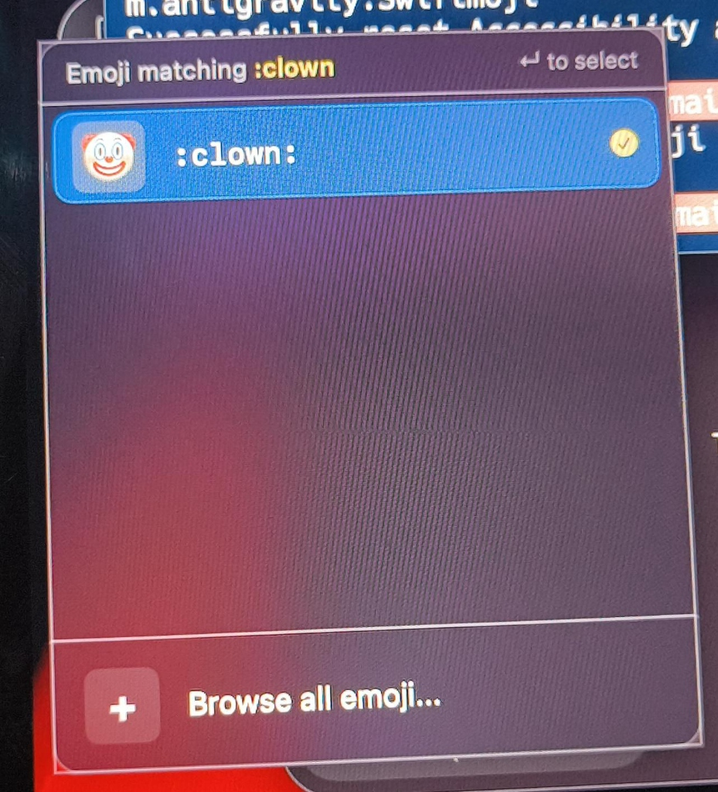
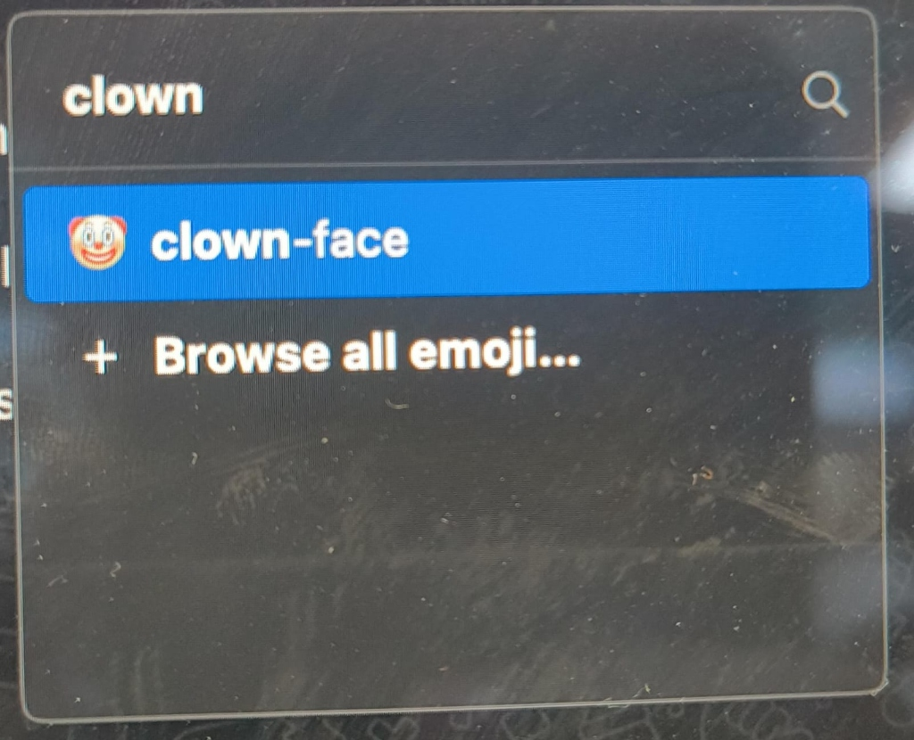

# Swiftmoji ☘︎

<p align="center">
  
</p>

**Swiftmoji** is a premium, lightweight, and native macOS utility designed specifically for Apple Silicon. It runs quietly as a background status bar agent, monitoring global keystrokes to let you type Slack-style shortcodes (e.g. `:thumbsup:`) in **any active application** and auto-complete them instantly near your text caret!

Featuring an elegant dark glassmorphic design language, responsive hover micro-animations, and a unified shortcut engine, Swiftmoji makes inserting expressive characters, symbols, and snippets effortless.

---

## 📸 App Preview

### 1. Modern Glassmorphic Autocomplete HUD
When you type your trigger character followed by a keyword, a borderless floating panel automatically aligns next to your text cursor:

<p align="center">
  
</p>

### 2. Premium "Browse All Emojis" Split-View Window
Selecting "+ Browse all emoji..." inside the HUD panel or using the global menu triggers the advanced 3-column split view browser:

<p align="center">
  
</p>

---

## ✨ Features

- **Global Autocomplete Engine:** Monitors keystroke combinations globally using WindowServer Session Event Taps, replacing shortcodes instantly without delaying your writing workflow.
- **Glassmorphic Floating HUD Panel:** An `NSPanel` subclass configured to float over other active documents (`.statusBar` level) *without stealing keyboard focus* so you can continue typing seamlessly.
- **Natural Keyboard Navigation:** Cycle through autocompletions using `Arrow Up` and `Arrow Down`, and confirm with `Enter` or `Tab`. Dismiss instantly by typing `Space` or pressing `Escape`.
- ** closing Colon Replacement:** Instantly completes triggers as soon as you type the closing colon (e.g., `:thumbsup:` immediately transforms to 👍).
- **Mouse Click Interaction:** The floating HUD supports direct click gestures on both emoji listings and the "Browse all emoji..." button.
- **Interactive Multi-Category Split-View Browser:**
  - **Emoji:** Search the database and filter by category (All, Smileys & People, Animals & Nature, Food & Drink, Travel & Places, Objects & Symbols).
  - **GIFs:** Browse trending media placeholder collections.
  - **ASCII Emoticons:** Select and copy classic text emoticons (like `¯\_(ツ)_/¯`, `(╯°□°）╯︵ ┻━┻`, `ಠ_ಠ`).
  - **Glyphs & Symbols:** Access special characters and layout symbols (`⌘`, `⌥`, `⇧`, `⌃`, ``, etc.).
  - **Snippets:** Save text and code snippets (e.g. Email signature, HTML boilerplate).
- **Custom Shortcode Mapping Engine:** Map **any customized keyword** to emojis, symbols, ASCII faces, or snippets in the Browser (e.g. map `upvote` to `👍` or `shrug` to `¯\_(ツ)_/¯`). Typing `:upvote:` or `:shrug:` system-wide instantly inserts them!
- **Control-Command-Space Interception:** Replaces the default basic native macOS emoji keyboard shortcut globally to slide open your premium Swiftmoji Browser instead!
- **Sleek Custom Aesthetics:** Customized `☘︎` status item title enlarged to `18pt` in the macOS menu bar, and custom origami bird app icon packaging.
- **Aesthetic Preferences Panel:** Configure settings like launch at login, Fitzgerald skin tone modifiers, sound effects toggles, and a **consecutive double trigger** key feature.

---

## 🛠️ Requirements & Building

- A Mac running Apple Silicon (M1/M2/M3/M4/M5 series) on macOS 11.0+.
- Xcode Command Line Tools installed.

### 1. Accept Xcode License
If you haven't compiled developer tools recently, run this in Terminal:
```bash
sudo xcodebuild -license
```

### 2. Compile and Package
Simply run the included build script:
```bash
./build.sh
```
This compiles the Swift source files, packages metadata configurations, compiles the origami bird `AppIcon.icns`, and **applies a deep ad-hoc code signature** (`codesign`) so macOS Accessibility permissions are remembered reliably across app restarts.

---

## 🚦 Getting Started

1. **Launch the application:**
   ```bash
   open Swiftmoji.app
   ```
2. **Grant Accessibility Permissions:**
   - On launch, macOS will present a permission prompt. Click **Open System Settings**.
   - Go to **System Settings > Privacy & Security > Accessibility**.
   - Toggle the switch next to **Swiftmoji** to enable it.
   - *Note:* If you ever need to clear system caches for this app, run:
     `tccutil reset Accessibility com.amitsarkar.Swiftmoji`
3. **Start Typing Emojis:**
   Open any application (Notes, Chrome, Slack, etc.) and type `:th` to see the autocomplete panel float next to your text caret!

---

## 📂 Project Structure

```
Swiftmoji/
├── build.sh                  # High-performance native build and signature script
├── Resources/
│   ├── Info.plist            # Bundle configuration (runs as background agent)
│   ├── AppIcon.icns          # Generated origami bird application icon
│   └── Screenshots/          # App visuals and UI mockup assets
└── Source/
    ├── SwiftmojiApp.swift    # SwiftUI App Entry Point (@main)
    ├── AppDelegate.swift     # Window launchers, status menu bar, and lifecycle
    ├── FloatingPanel.swift   # Borderless non-activating visual HUD panel
    ├── AutocompleteView.swift # Autocomplete list layout with mouse tap gestures
    ├── EmojiBrowserView.swift # Premium 3-column split view search & tag editor
    ├── KeyboardManager.swift  # Keystroke interceptor, backspace injector, and shortcuts
    └── EmojiDatabase.swift   # Optimised database mapping custom and default shortcodes
```
