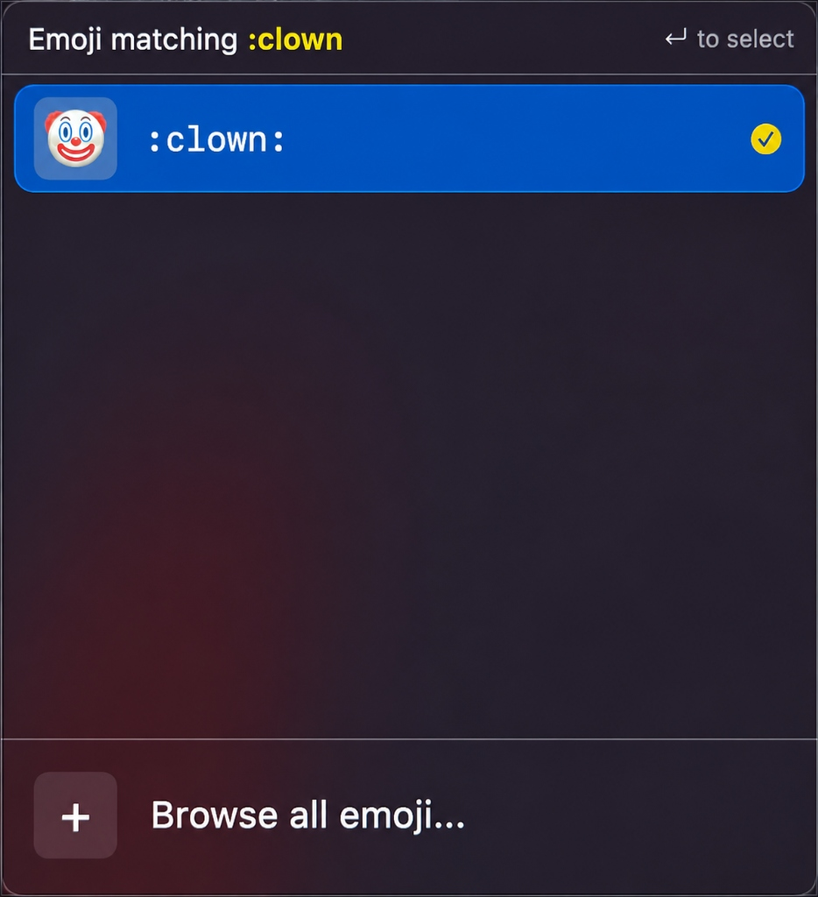
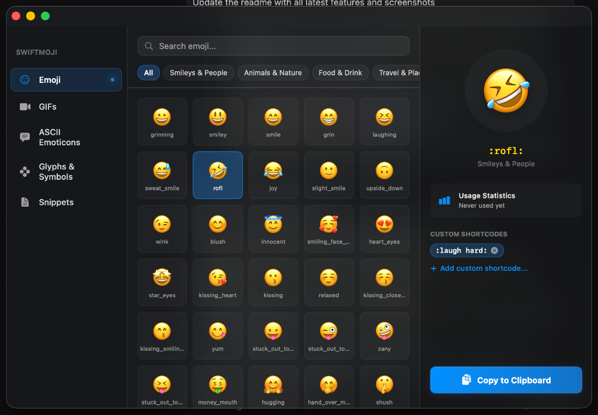
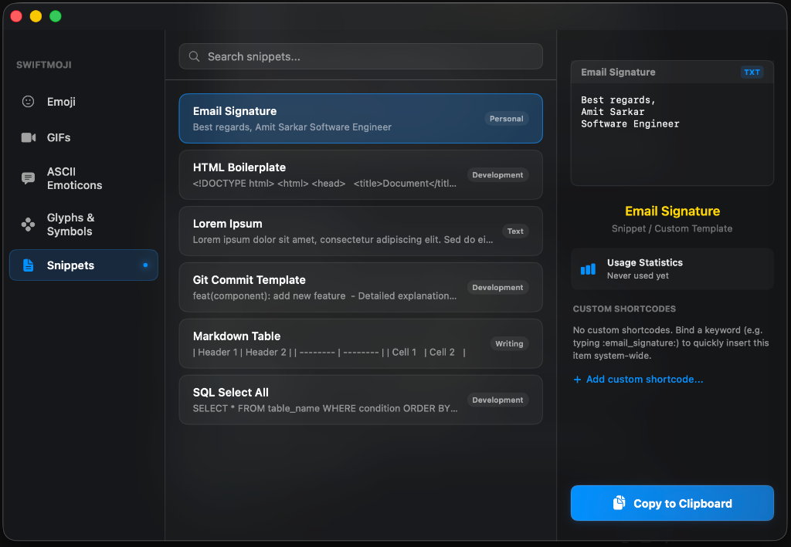
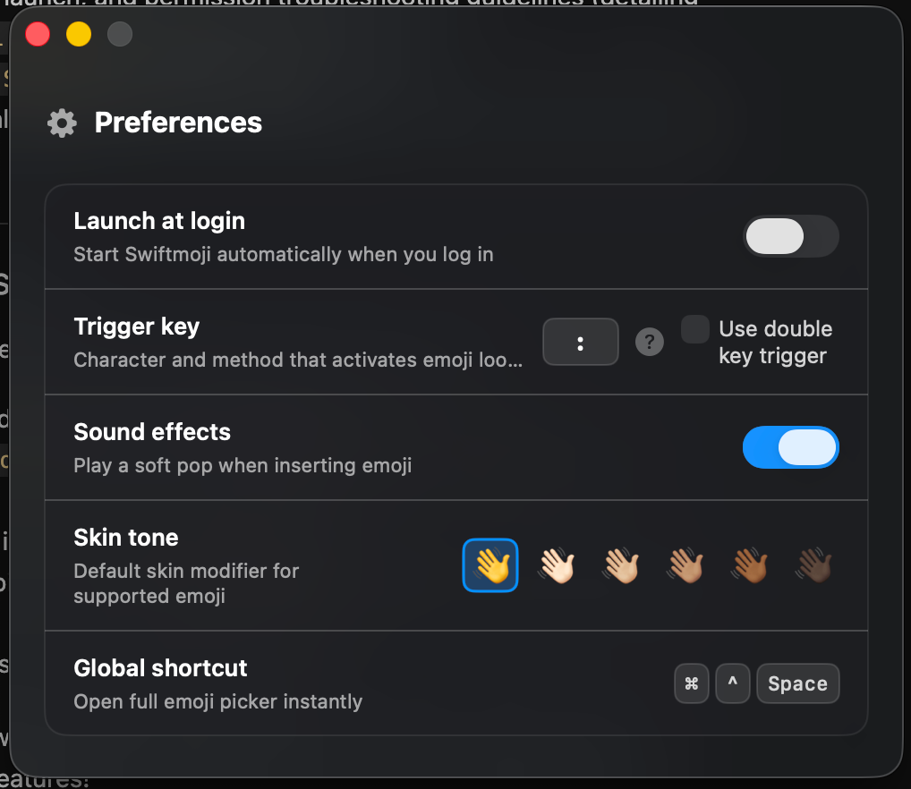

# Swiftmoji 🕊️

<p align="center">
  
</p>

<p align="center">
  <strong>The Native macOS Emoji & Snippet Powerhouse for Apple Silicon</strong>
</p>

<p align="center">
  
  
  
  
  
</p>

---

## 🌟 What is Swiftmoji?

**Swiftmoji** is a premium, ultra-lightweight, and native macOS utility designed specifically for Apple Silicon. It runs quietly in your menu bar as a background agent, monitoring keystrokes via low-level WindowServer Event Taps to let you type shortcodes (e.g. `\\thumbsup` or `\\coffee`) in **any active application** and auto-complete them instantly next to your text caret!

### ⚡ Key Highlights
* **Universal Keyboard Trigger (`\\`):** Activated by typing a double backslash (`\\`) followed by your keyword—works effortlessly on every laptop keyboard layout in the world without conflicting with comments or paths.
* **Non-Activating Caret HUD:** A borderless glassmorphic `NSPanel` floating at `.statusBar` level that aligns dynamically with your text cursor *without stealing keyboard focus*.
* **Interactive 3-Column Split Browser:** Search and browse across **Emojis**, **GIFs**, **ASCII Emoticons** (`¯\_(ツ)_/¯`), **Typography Glyphs** (`⌘`, `⌥`, ``), and personalized **Snippets**.
* **Global Shortcut Override:** Replaces the default macOS emoji picker (`Ctrl+Cmd+Space`) to summon Swiftmoji's 3-column browser.
* **100% Offline & Private:** Zero network requests, zero telemetry, and zero tracking. Your keystrokes never leave your Mac.

---

## 🌐 Product Discovery Website

Swiftmoji includes a modern, self-contained landing website inside [`website/`](website/):
* **Live Keystroke Simulator:** Experience typing `\\coffee`, `\\shrug`, and `\\fire` with an animated caret HUD directly in your browser.
* **Real App Showcase:** Interactive tabbed gallery and full-screen lightbox zoom featuring real screenshots of the app.
* **Direct macOS Downloads:** Pre-packaged links to `.dmg` and `.zip` installers with verified SHA-256 integrity checksums.

### Preview Website Locally:
```bash
# Option 1: Open directly in your browser
open website/index.html

# Option 2: Serve via local HTTP server
cd website && python3 -m http.server 8080
# Visit http://localhost:8080
```

---

## 📸 App Preview

### 1. Modern Glassmorphic Autocomplete HUD
When you type `\\` followed by a keyword (e.g. `\\th`), a borderless floating panel automatically aligns next to your text cursor:

<p align="center">
  
</p>

### 2. Premium "Browse All Emojis" Split-View Window
Selecting "+ Browse all emoji..." inside the HUD panel or pressing `Ctrl+Cmd+Space` opens the advanced 3-column split view browser:

<p align="center">
  
</p>

### 3. Custom Templates & Snippets Library
Browse, search, and bind customized global shortcodes to frequently used text, signatures, and code templates:

<p align="center">
  
</p>

### 4. Interactive Preferences Panel
Quickly customize launch behaviors, trigger characters, double-key activation toggles, sound effects, and default Fitzpatrick skin tones:

<p align="center">
  
</p>

---

## ✨ Features

- **Global Autocomplete Engine:** Monitors keystroke combinations globally using WindowServer Session Event Taps, replacing shortcodes instantly without delaying your typing.
- **Glassmorphic Floating HUD Panel:** An `NSPanel` subclass configured to float over other active documents (`.statusBar` level) *without stealing keyboard focus* so you can continue typing seamlessly.
- **Natural Keyboard Navigation:** Cycle through autocompletions using `Arrow Up` and `Arrow Down`, and confirm with `Enter` or `Tab`. Dismiss instantly by typing `Space` or pressing `Escape`.
- **Closing Delimiter Replacement:** Instantly completes triggers as soon as you type the closing delimiter (e.g., `\\thumbsup\` or `:thumbsup:` immediately transforms to 👍).
- **Mouse Click Interaction:** The floating HUD supports direct click gestures on both emoji listings and the "Browse all emoji..." button.
- **Interactive Multi-Category Split-View Browser:**
  - **Emoji:** Search the database and filter by category (Smileys & People, Animals & Nature, Food & Drink, Travel & Places, Objects & Symbols).
  - **GIFs:** Browse trending and search-based animated media collections.
  - **ASCII Emoticons:** Select and copy classic text emoticons (like `¯\_(ツ)_/¯`, `(╯°□°）╯︵ ┻━┻`, `ಠ_ಠ`).
  - **Glyphs & Symbols:** Access special characters and layout symbols (`⌘`, `⌥`, `⇧`, `⌃`, ``, etc.).
  - **Snippets:** Save text and code snippets (e.g. Email signature, HTML boilerplate).
- **Custom Shortcode Mapping Engine:** Map **any customized keyword** to emojis, symbols, ASCII faces, or snippets in the Browser (e.g. map `upvote` to `👍` or `shrug` to `¯\_(ツ)_/¯`). Typing `\\upvote` or `\\shrug` system-wide instantly inserts them!
- **Control-Command-Space Interception:** Replaces the default basic native macOS emoji keyboard shortcut globally to slide open your premium Swiftmoji Browser instead!
- **Sleek Custom Aesthetics:** Customized origami bird status bar item in the macOS menu bar with automatic Light and Dark mode adaptive styling.
- **Aesthetic Preferences Panel:** Configure settings like launch at login, Fitzpatrick skin tone modifiers, sound effects toggles, and consecutive double trigger keys.

---

## 🛠️ Requirements & Building

- A Mac running Apple Silicon (M1/M2/M3/M4/M5 series) on macOS 11.0+.
- Xcode Command Line Tools installed (`xcode-select --install`).

### 1. Compile and Bundle
Simply run the included build script:
```bash
./build.sh
```
This compiles the Swift source files, packages metadata configurations, compiles the origami bird `AppIcon.icns`, and **applies a persistent code signature** (`codesign`) so macOS Accessibility permissions are remembered reliably across app restarts.

### 2. Package Distribution Binaries (.dmg & .zip)
To generate release-ready distribution packages and SHA-256 checksums:
```bash
./package_dist.sh
```
Output files are placed in [`Dist/`](Dist/):
* `Swiftmoji.dmg` — Apple Disk Image installer with drag-and-drop support.
* `Swiftmoji-macOS.zip` — Universal ZIP archive preserving macOS extended attributes and code signatures.
* `SHA256SUMS.txt` — SHA-256 integrity checksums.

---

## 🚦 Getting Started

1. **Launch the application:**
   ```bash
   open Swiftmoji.app
   ```
2. **Grant Accessibility Permissions:**
   - On launch, macOS will present a permission prompt. Click **Open System Settings**.
   - Go to **System Settings > Privacy & Security > Accessibility**.
   - Toggle the switch next to **Swiftmoji** to enable it.
   - *Note:* If you ever need to reset system accessibility permissions for this app, run:
     ```bash
     tccutil reset Accessibility com.amitsarkar.Swiftmoji
     ```
3. **Start Typing Emojis:**
   Open any application (Notes, Chrome, Slack, VS Code, etc.) and type `\\th` to see the autocomplete panel float next to your text caret! Press `Enter` or click to complete `👍`.

---

## 📂 Project Structure

```
Swiftmoji/
├── build.sh                  # Native compilation and code-signing script
├── package_dist.sh           # DMG and universal ZIP packaging script
├── Resources/
│   ├── Info.plist            # Bundle configuration (runs as background agent)
│   ├── AppIcon.icns          # Generated origami bird application icon
│   ├── statusBarIcon*.png    # Menu bar icons for light & dark themes
│   └── Screenshots/          # App visuals and UI mockup assets
├── Source/
│   ├── SwiftmojiApp.swift    # SwiftUI App Entry Point (@main)
│   ├── AppDelegate.swift     # Window launchers, status menu bar, and lifecycle
│   ├── FloatingPanel.swift   # Borderless non-activating visual HUD panel
│   ├── AutocompleteView.swift # Autocomplete list layout with mouse tap gestures
│   ├── EmojiBrowserView.swift # Premium 3-column split view search & tag editor
│   ├── KeyboardManager.swift  # Keystroke interceptor, backspace injector, and shortcuts
│   ├── EmojiDatabase.swift   # Optimised database mapping custom and default shortcodes
│   ├── GifService.swift      # Trending and query-based GIF provider
│   ├── AnimatedGIFView.swift # Native GIF playback view
│   └── PreferencesView.swift # Skin tone, trigger key, and startup preferences
├── Dist/                     # Generated release packages
│   ├── Swiftmoji.dmg         # macOS disk image installer
│   ├── Swiftmoji-macOS.zip   # Universal ZIP archive
│   └── SHA256SUMS.txt        # Cryptographic checksums
└── website/                  # Product discovery and download website
    ├── index.html            # Landing page with live simulator & real screenshots
    ├── assets/
    │   ├── css/custom.css    # Glassmorphic macOS UI styling
    │   ├── js/app.js         # Interactive live simulator & lightbox scripts
    │   └── images/           # High-resolution screenshots & assets
    └── downloads/            # Direct download installers
```

---

## 🔒 Security & Privacy

* **100% Offline:** Swiftmoji does not make outbound network connections for core emoji lookup or key listening. Keystrokes never leave your machine.
* **Persistent Permissions:** Deeply signed with a developer identity so macOS remembers Accessibility privileges across restarts.
